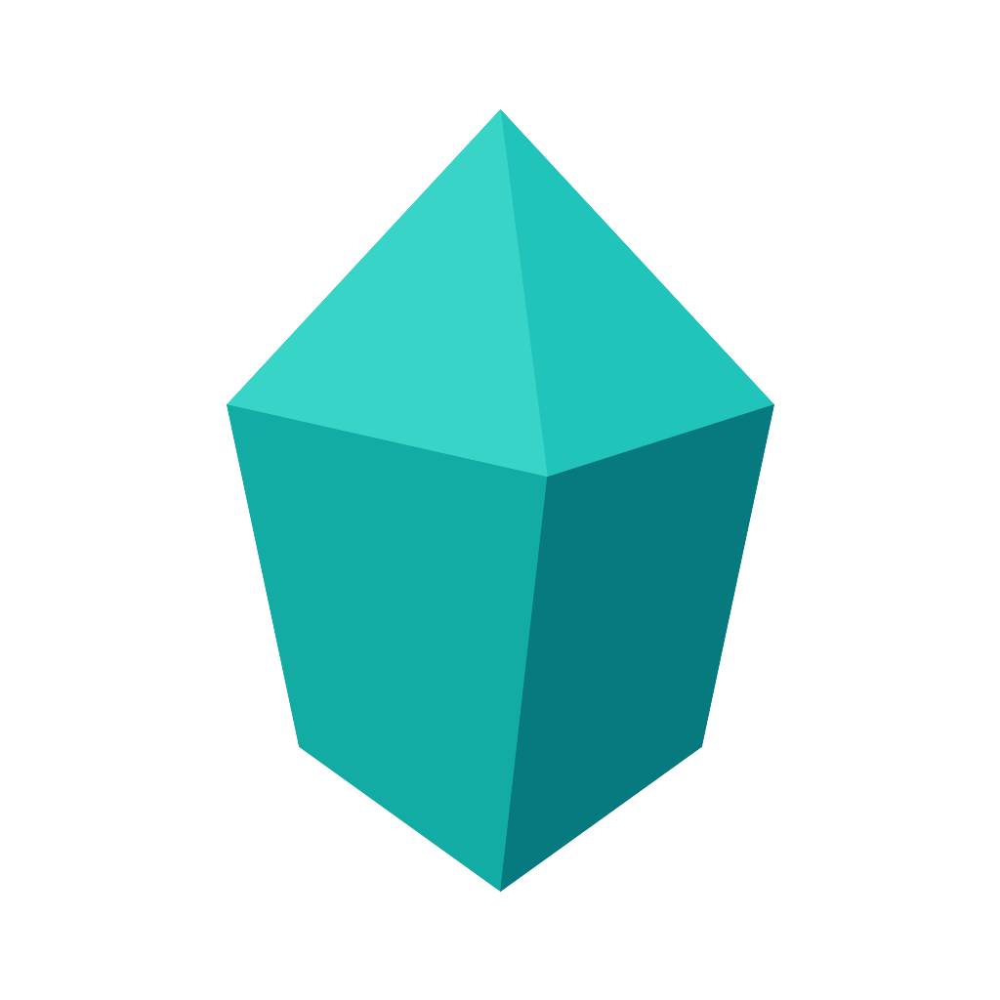

#  Godot - GLTF Pipeline

> [!WARNING] 
> **Work in progress**
> 
> This document describes the intended functionality. <br>
> Some features may not yet be implemented at the time of reading.

This repository provides tools for a **reliable asset delivery pipeline** from **Blender** to **Godot** using the **glTF** format.
It includes a Blender add-on for export automation and a Godot add-on for import and linking.

## Overview

In a typical setup, your project repository contains:

* **Source assets** (Blender files)
* **Godot game project** (target assets and game scenes)

### Workflow

1. **Blender Add-on**

   * Configures export rules for `.blend` files.
   * Exports assets as `.gltf` directly into your Godot project.

2. **Godot Add-on**

   * Handles import and linking of exported glTFs.
   * Supports **custom modifiers** during the import phase for automated scene adjustments.

## Example Project Structure

```
Root of Project
├── .blender_project
├── assets/                     # Source Blender assets
│   ├── props/
│   │   └── box/
│   │       └── box.blend
│   └── scenes/
│       └── room/
│           └── room.blend
└── game/                       # Godot project
    ├── project.godot
    ├── asset_index.json        # Metadata about exported assets
    └── assets/                 # Exported glTFs and linked scenes
        ├── props/
        │   └── box/
        │       ├── box.tscn    # Scene to customize asset
        │       └── box.gltf
        ├── scenes/
        │   └── room/
        │       ├── room.tscn
        │       └── room.gltf
        └── ...
```

> [!NOTE] 
> **Folder structure is mirrored**
> 
> The exported file structure mirrors the directory layout relative to the folder containing `.blender_project`.<br>
> This ensures consistent asset organization between Blender and Godot.

> [!NOTE] 
> **Editable .tscn Files**
> 
> `.tscn` files are generated once during the import phase and are safe to modify manually.<br>
> They will not be overwritten on subsequent imports.

## Inspiration and References

This project is heavily inspired by existing Blender-Godot workflow tools.

While these projects provided a great starting point, I noticed some limitations and rough edges.

My goal here is to streamline the process and adapt it to my needs, keeping the workflow as minimal as possible, free from hardcoded parts, and highly extensible.

- [DOGWALK - Blender Studio](https://studio.blender.org/projects/dogwalk/)
- [Blender To Godot 4 Pipeline Addon](https://michaeljared.itch.io/blender-to-godot-4-pipeline-addon)
